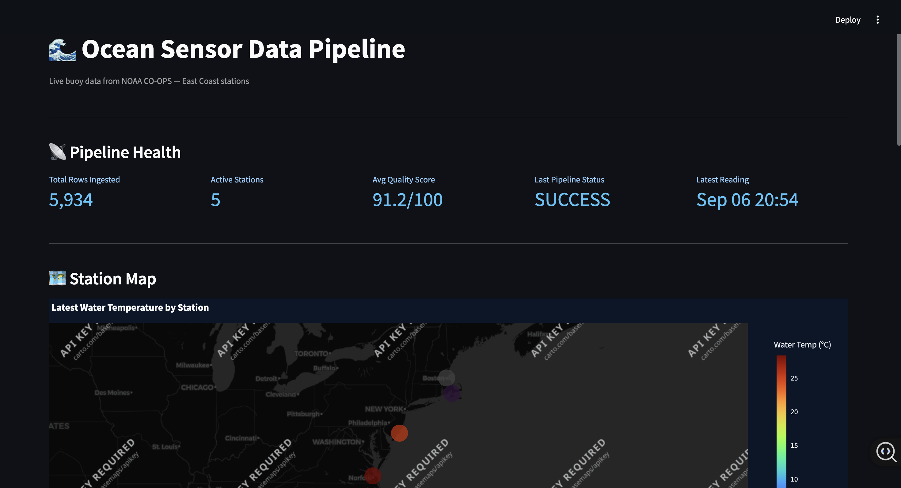
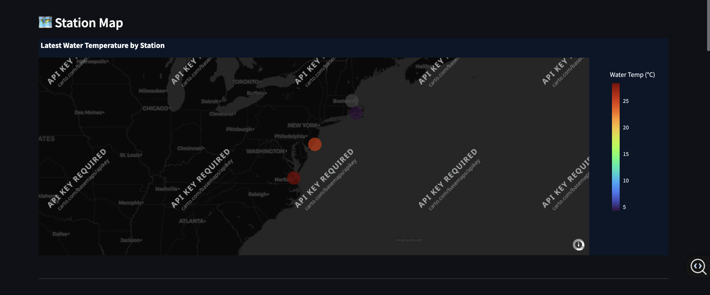
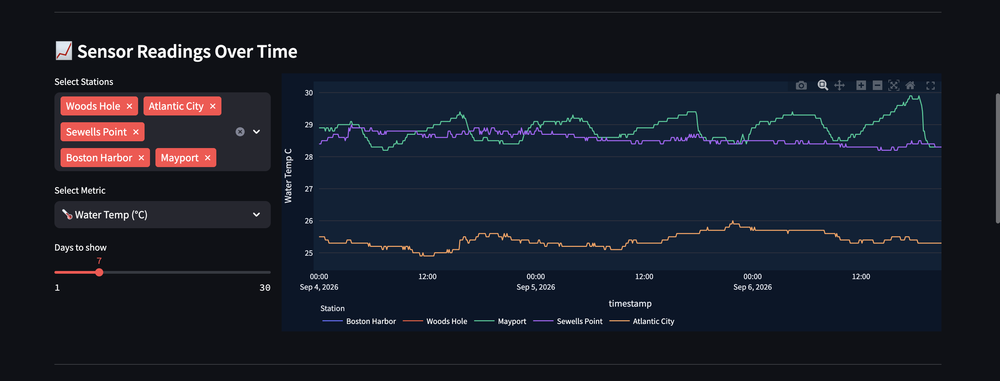
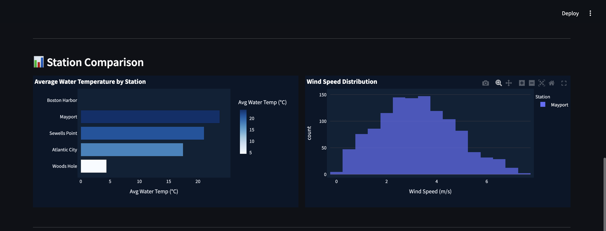
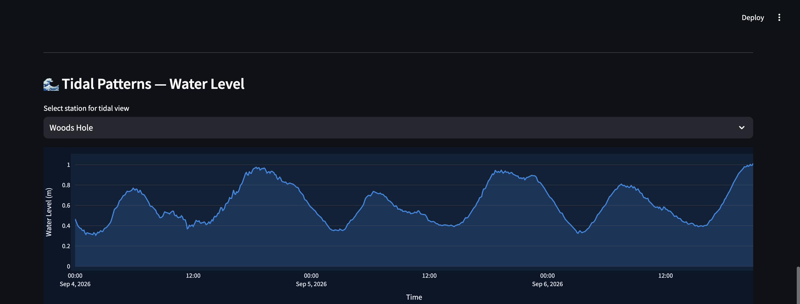

# 🌊 Ocean Sensor Data Pipeline

A production-grade end-to-end data engineering pipeline that ingests real-time ocean buoy sensor data from NOAA CO-OPS, validates and transforms it, stores it in PostgreSQL, and displays it through an interactive analytics dashboard.

The entire system is containerized with Docker and designed to demonstrate practical data engineering concepts using real marine sensor data.

> Built around real-world ocean technology and data engineering workflows.

---

## 📸 Dashboard Preview



The dashboard provides a live overview of pipeline health, active NOAA stations, data quality, latest sensor readings, and geographic station information.

### Current Pipeline Health

- **2,485+ sensor readings ingested**
- **5 active NOAA stations**
- **92/100 average data quality score**
- Pipeline status monitoring
- Live ocean sensor observations

---

## 🏗️ Architecture

```text
                    NOAA CO-OPS API
                  5 East Coast Stations
                           │
                           ▼
                   ┌───────────────┐
                   │ noaa_fetcher  │
                   │    Extract    │
                   └───────┬───────┘
                           │
                           ▼
                   ┌───────────────┐
                   │    cleaner    │
                   │ Clean + Dedup │
                   └───────┬───────┘
                           │
                           ▼
                   ┌───────────────┐
                   │   validator   │
                   │ Quality Score │
                   └───────┬───────┘
                           │
                           ▼
                   ┌───────────────┐
                   │  transformer  │
                   │ Feature Eng.  │
                   └───────┬───────┘
                           │
                           ▼
                   ┌───────────────┐
                   │ PostgreSQL 15 │
                   │   Storage     │
                   └───────┬───────┘
                           │
                           ▼
                 ┌───────────────────┐
                 │ Streamlit + Plotly│
                 │ Analytics Dashboard│
                 └───────────────────┘
```

---

## 🗺️ Live NOAA Station Monitoring

The pipeline currently monitors five NOAA CO-OPS stations along the U.S. East Coast.



| Station ID | Location | State |
|---|---|---|
| 8443970 | Boston Harbor | MA |
| 8447930 | Woods Hole | MA |
| 8638610 | Sewells Point | VA |
| 8720218 | Mayport | FL |
| 8534720 | Atlantic City | NJ |

The dashboard plots each station geographically and visualizes the latest available water temperature.

---

## 📡 Collected Sensor Data

The pipeline collects multiple environmental measurements from NOAA.

| Metric | Unit | Description |
|---|---|---|
| Water Temperature | °C | Sea surface temperature |
| Air Temperature | °C | Atmospheric temperature |
| Wind Speed | m/s | Surface wind speed |
| Water Level | m | Tidal water level using MLLW datum |
| Air Pressure | mb | Barometric pressure |

---

## 📈 Sensor Readings Over Time

Users can interactively select stations, metrics, and the number of days displayed.



The dashboard allows multiple stations to be compared on the same timeline, making differences in environmental conditions easier to identify.

---

## 📊 Station Comparison

The analytics layer compares environmental conditions between monitoring stations.



Current visualizations include:

- Average water temperature by station
- Wind-speed distribution
- Cross-station environmental comparisons
- Interactive Plotly charts

---

## 🌊 Tidal Pattern Analysis

The pipeline also tracks water-level changes to visualize tidal behavior.



Users can select an individual NOAA station and inspect its water-level changes over time.

This makes periodic tidal patterns directly visible from the ingested sensor data.

---

## 🛠️ Tech Stack

| Layer | Technology |
|---|---|
| Ingestion | Python 3.11, Requests |
| Transformation | pandas, NumPy |
| Validation | Custom quality scoring engine |
| Storage | PostgreSQL 15 |
| ORM / Database Access | SQLAlchemy |
| Dashboard | Streamlit |
| Visualization | Plotly |
| Scheduling | APScheduler |
| Containerization | Docker, Docker Compose |
| Data Source | NOAA CO-OPS API |

---

## 📁 Project Structure

```text
ocean-pipeline/
│
├── assets/
│   ├── dashboard-overview.png
│   ├── station-map.png
│   ├── station-comparison.png
│   ├── tidal-patterns.png
│   └── sensor-readings.png
│
├── docker-compose.yml
├── Dockerfile.pipeline
├── Dockerfile.dashboard
├── requirements.txt
├── .env
├── .gitignore
│
├── ingestion/
│   ├── noaa_fetcher.py
│   └── scheduler.py
│
├── transformation/
│   ├── cleaner.py
│   ├── validator.py
│   └── transformer.py
│
├── database/
│   ├── db_client.py
│   ├── models.py
│   └── init.sql
│
└── dashboard/
    └── app.py
```

---

## 🔄 Pipeline Workflow

### 1. Extract

`noaa_fetcher.py` retrieves live environmental observations from the NOAA CO-OPS API.

The pipeline collects the latest available data from each configured monitoring station.

### 2. Clean

`cleaner.py` prepares raw sensor observations before storage.

Processing includes:

- Replacing NOAA sensor error codes
- Handling missing values
- Removing duplicate observations
- Detecting invalid sensor readings
- Handling short gaps in observations

### 3. Validate

`validator.py` evaluates each batch and calculates a data-quality score from **0 to 100**.

### 4. Transform

`transformer.py` performs feature engineering and prepares observations for analytics.

Derived information includes:

- Season
- Wind categories
- Heat-index related features
- Normalized measurements

### 5. Load

Processed observations are persisted in PostgreSQL.

Duplicate observations are prevented using the combination of:

```text
station_id + timestamp
```

### 6. Visualize

Streamlit queries the PostgreSQL database and presents the processed data using interactive Plotly visualizations.

---

## 🔍 Data Quality Monitoring

Every batch receives an automated quality score.

| Factor | Maximum Penalty |
|---|---:|
| Missing/null values | 40 points |
| Outlier readings | 30 points |
| Time gaps greater than 60 minutes | 30 points |

A typical observed quality score is approximately:

```text
92 / 100
```

Some stations do not operate every type of sensor, so missing measurements can be expected for particular metrics.

Pipeline execution information is also stored so failed or successful ingestion runs can be inspected.

---

## 🗄️ Database Schema

### `stations`

```sql
stations (
    station_id VARCHAR PRIMARY KEY,
    name VARCHAR,
    state VARCHAR,
    latitude NUMERIC,
    longitude NUMERIC
)
```

### `sensor_readings`

```sql
sensor_readings (
    id SERIAL PRIMARY KEY,
    station_id VARCHAR REFERENCES stations,
    timestamp TIMESTAMP,
    water_temp_c NUMERIC,
    air_temp_c NUMERIC,
    wind_speed_ms NUMERIC,
    water_level_m NUMERIC,
    air_pressure_mb NUMERIC,
    ingested_at TIMESTAMP DEFAULT NOW(),

    UNIQUE(station_id, timestamp)
)
```

### `data_quality_log`

```sql
data_quality_log (
    station_id VARCHAR,
    checked_at TIMESTAMP,
    total_rows INTEGER,
    null_count INTEGER,
    outlier_count INTEGER,
    quality_score NUMERIC
)
```

### `pipeline_runs`

```sql
pipeline_runs (
    ran_at TIMESTAMP,
    status VARCHAR,
    rows_ingested INTEGER,
    error_message TEXT
)
```

---

## ⚙️ Pipeline Behavior

The pipeline is designed to run continuously.

- Runs automatically every hour with APScheduler
- Fetches recent NOAA observations during each execution
- Cleans raw sensor measurements
- Detects invalid sensor values
- Prevents duplicate database records
- Performs automated data-quality checks
- Stores processed observations in PostgreSQL
- Records pipeline execution status
- Makes the latest data available to the Streamlit dashboard

---

## 🚀 Getting Started

### Prerequisites

Make sure you have:

- Docker Desktop
- Docker Compose
- Git

Docker Desktop must be running before starting the containers.

### 1. Clone the repository

```bash
git clone https://github.com/rachana1707-S/ocean-pipeline.git
cd ocean-pipeline
```

### 2. Start the application

```bash
docker compose up --build
```

Docker Compose starts:

```text
PostgreSQL
     ↓
Ocean Data Pipeline
     ↓
Streamlit Dashboard
```

PostgreSQL initializes the database schema on first startup.

The ingestion pipeline runs when the container starts and then continues according to its configured schedule.

### 3. Open the dashboard

After the containers start, open:

```text
http://localhost:8501
```

---

## 💻 Local Development

To execute the pipeline manually:

```bash
python3 -c "from ingestion.scheduler import run_pipeline; run_pipeline()"
```

When running outside Docker, configure the PostgreSQL host appropriately in your `.env`.

To run only the dashboard:

```bash
streamlit run dashboard/app.py
```

---

## 🐳 Useful Docker Commands

Start the complete system:

```bash
docker compose up --build
```

Run in the background:

```bash
docker compose up -d
```

Check running containers:

```bash
docker compose ps
```

View pipeline logs:

```bash
docker compose logs -f pipeline
```

Stop the system:

```bash
docker compose down
```

Rebuild after code changes:

```bash
docker compose up --build
```

---

## 🔮 Roadmap

Future improvements include:

- AI-powered anomaly detection
- Natural-language anomaly explanations
- Automated daily ocean-condition reports
- Natural-language queries over sensor data
- 24-hour environmental forecasting
- AUV telemetry ingestion
- Mission replay visualization
- CTD sensor synchronization
- AWS deployment using RDS and ECS
- Pipeline monitoring and automated alerts

---

## 🎯 What This Project Demonstrates

This project demonstrates practical experience with:

**Data Engineering**
- ETL pipeline development
- Data cleaning and transformation
- Data validation
- Time-series sensor data
- Data-quality monitoring

**Backend & Infrastructure**
- PostgreSQL
- SQLAlchemy
- Docker
- Docker Compose
- Scheduled background processing

**Analytics**
- Streamlit
- Plotly
- Interactive time-series visualization
- Geographic sensor visualization

**Real-World Data Integration**
- REST API ingestion
- NOAA CO-OPS environmental data
- Missing sensor measurements
- Duplicate prevention
- Sensor error handling

---

## 👩‍💻 Author

**Rachana Sudhakar**

MS Computer Science  
Northeastern University

GitHub: [rachana1707-S](https://github.com/rachana1707-S)